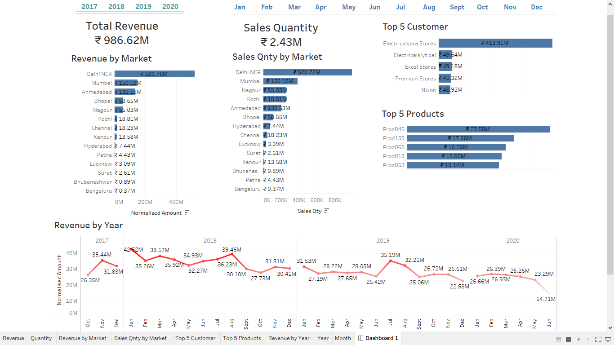

## Sales Insights Data Analysis Project

### Data Analysis Using SQL

LINK TO THE TABLEAU DASHBOARD 
[https://prod-apnortheast-a.online.tableau.com/t/mi6abhid3b2060c5f/views/SalesInsights/Dashboard1?:origin=card_share_link&:embed=n]

1. All customer records

    `SELECT * FROM customers;`

1. Total number of customers

    `SELECT count(*) FROM customers;`

1. Transactions for Chennai market (market code for chennai is Mark001

    `SELECT * FROM transactions where market_code='Mark001';`

1. Distrinct product codes that were sold in chennai

    `SELECT distinct product_code FROM transactions where market_code='Mark001';`

1. Transactions where currency is US dollars

    `SELECT * from transactions where currency="USD"`

1. Transactions in 2020 join by date table

    `SELECT transactions.*, date.* FROM transactions INNER JOIN date ON transactions.order_date=date.date where date.year=2020;`

1. Total revenue in year 2020,

    `SELECT SUM(transactions.sales_amount) FROM transactions INNER JOIN date ON transactions.order_date=date.date where date.year=2020 and transactions.currency="INR\r" or transactions.currency="USD\r";`
	
1. Total revenue in year 2020, January Month,

    `SELECT SUM(transactions.sales_amount) FROM transactions INNER JOIN date ON transactions.order_date=date.date where date.year=2020 and and date.month_name="January" and (transactions.currency="INR\r" or transactions.currency="USD\r");`

1. Total revenue in year 2020 in Chennai

    `SELECT SUM(transactions.sales_amount) FROM transactions INNER JOIN date ON transactions.order_date=date.date where date.year=2020
and transactions.market_code="Mark001";`

